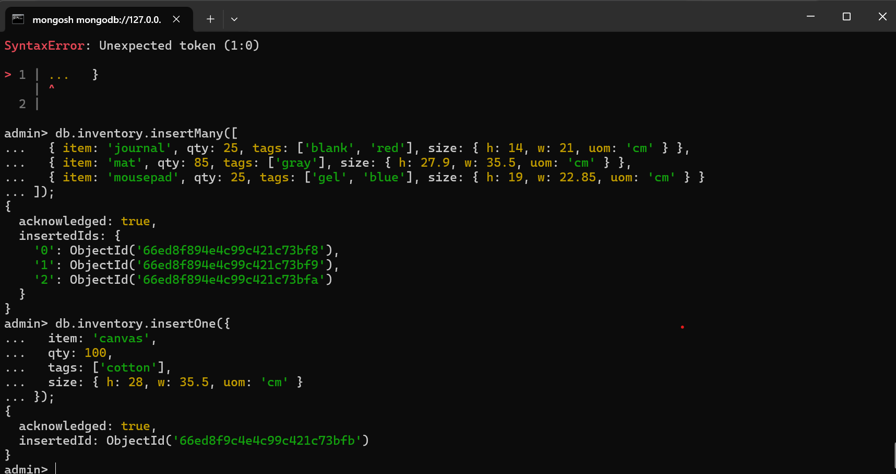
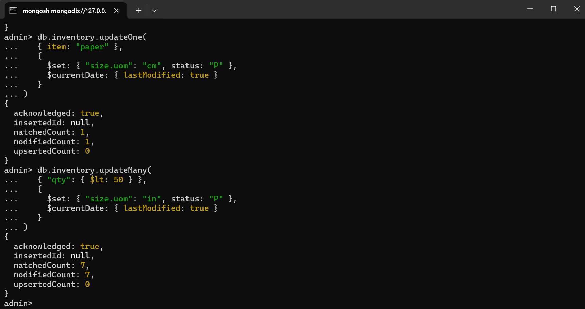
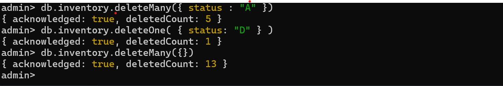
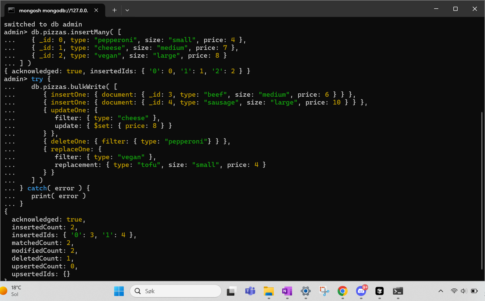
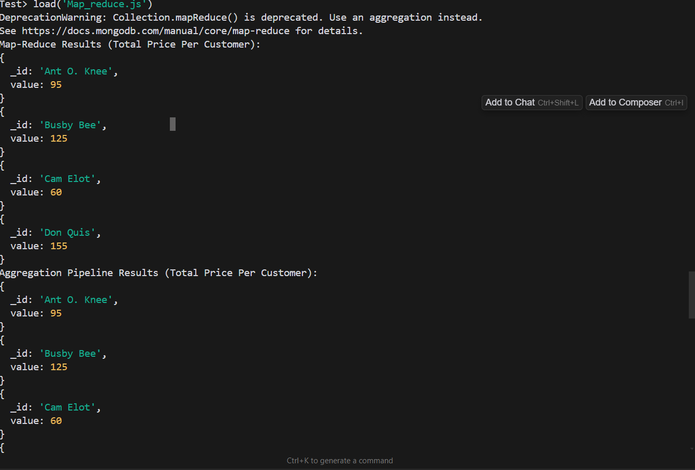
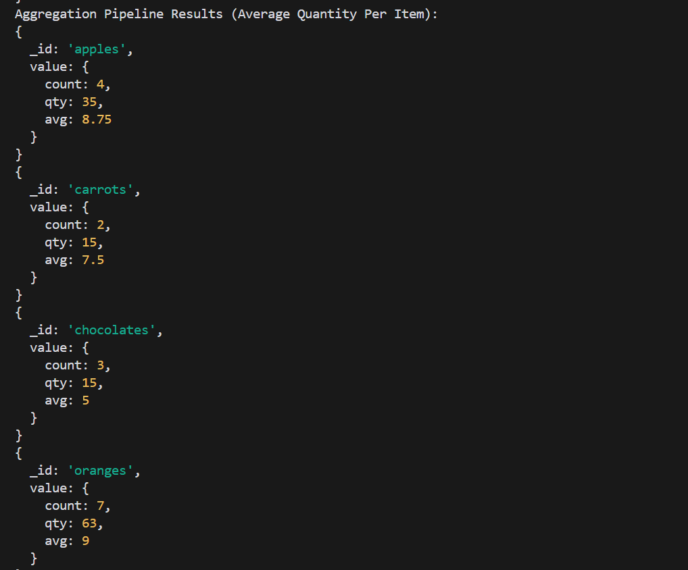

# MongoDB 

## Explanation
To solve these tasks I used MongoSH together with Mongo Compass. For some of the operations I made typescripts or javaScripts also. Either I just typed in the commands in the terminal, or I would run the scripts. I followed the installation guides to install everything, which all went fine.

## Challenges
* It was challenging to understand how to run the queries and the commands. After a while I understood that I could download and use mongosh in the terminal, and then select the code from the turorials which could be used in terminal. I started first using MongoDB compass, which was okay, but I did not manage to run all commands there. I found it easier to use mongosh.
* It was hard to understand what MONGODB actually was in the beginning. I now understand that it is a tool for handling databases, which is easy to scale. There are different ways to handle the data within this tool.

## Screenshots from Experiment 1, Crud Operations:

## Screenhots from Experiment 2, aggregation and map reduce: 

*
